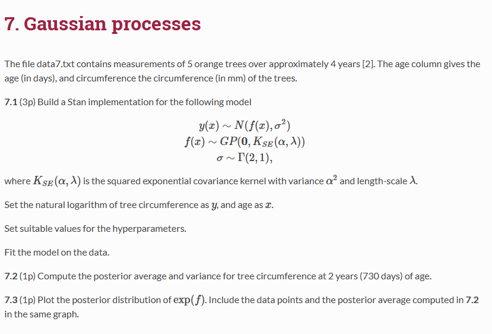
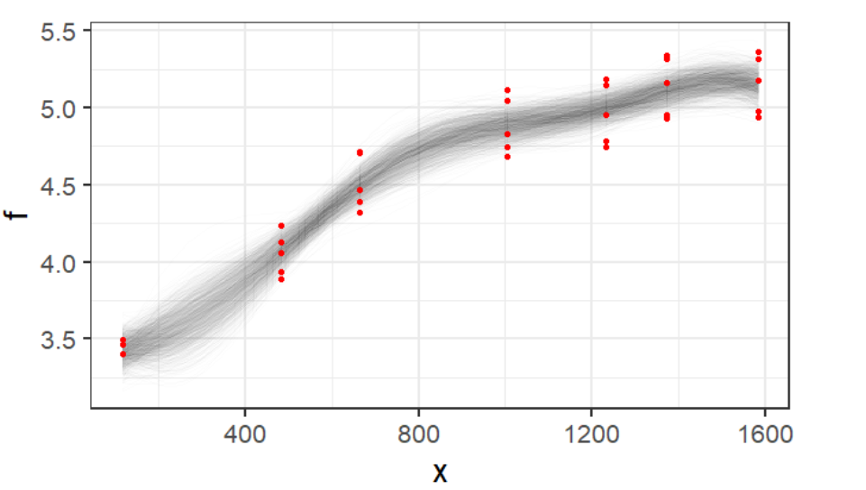

## 1. Explanation            
#### 1.1 What is the difference between an informative and a non-informative prior? 

An informative prior will be used when we had a strong knowledge or had strong beliefs. Kerman (2011) discusses non-informative and informative conjugate prior distributions for the binomial and Poisson models in detail [1, p67]. On the other hand, a non-informative prior is used when we have no prior information, and we want a prior with minimal influence on the inference. The non-informative prior employed in the proposed Bayesian procedure is derived using the Berger and Bernardo reference prior principle [2, p25–37]. 

**Informative Prior:**
An informative prior is used when we have strong knowledge or strong beliefs about the parameter. For example, if we know the average weight of an adult is around 70 kg, we can use a normal distribution with a mean of 70 kg and a small variance: θ∼N(70, 5²).

Another example is predicting the temperature in Helsinki in February, where historical records suggest an average between -2°C and -7°C with low variability.

**Non-informative Prior:**
A non-informative prior is used when we lack prior information and want the prior to have minimal influence on the inference. It is typically wide, such as a uniform distribution. For instance, if we have no prior knowledge about the average weight of an adult, we might use: θ∼Uniform(0,200).

Another example is predicting the height of a newly discovered creature that has never been studied.

#### 1.2 Given N posterior samples {αi,βi}, where i = 1,…,N is the sample index, how can you compute marginal posterior samples for √α?

Marginal Posterior Samples are samples from the posterior distribution of a particular parameter, obtained by marginalizing the other parameters. We have N posterior samples {αi,βi} from distribution i = 1,…,N is the sample index. To sample the boundary for √α, we will ignore βi, and keep αi

```
# Generate Posterial sample
# Use Stan library
library(rstan)

# Write a Stan model to describe the data with parameter 𝛼
data {
  int<lower=0> N;       // Number of observations
  vector[N] y;          // Observational data
}

parameters {
  real mu;              // Average
  real<lower=0> alpha;  // Variance
}

model {
   alpha ~ lognormal(0, 0.5); // Prior alpha with small expectation and small variance
  y ~ normal(mu, sqrt(alpha));  // Likelihood distribution
}
# Create simulation data
set.seed(123)
N <- 100
y <- rnorm(100, mean = 5, sd = 1)
data_list <- list(N = N, y = y)

# Complie and run stan model 
fit <- stan(file = "model.stan", data = data_list, iter = 2000, chains = 4)

```
```
SAMPLING FOR MODEL 'anon_model' NOW (CHAIN 1).
Chain 1: 
Chain 1: Gradient evaluation took 5e-06 seconds
Chain 1: 1000 transitions using 10 leapfrog steps per transition would take 0.05 seconds.
Chain 1: Adjust your expectations accordingly!
Chain 1: 
Chain 1: 
Chain 1: Iteration:    1 / 2000 [  0%]  (Warmup)
Chain 1: Iteration:  200 / 2000 [ 10%]  (Warmup)
Chain 1: Iteration:  400 / 2000 [ 20%]  (Warmup)
Chain 1: Iteration:  600 / 2000 [ 30%]  (Warmup)
Chain 1: Iteration:  800 / 2000 [ 40%]  (Warmup)
Chain 1: Iteration: 1000 / 2000 [ 50%]  (Warmup)
Chain 1: Iteration: 1001 / 2000 [ 50%]  (Sampling)
Chain 1: Iteration: 1200 / 2000 [ 60%]  (Sampling)
Chain 1: Iteration: 1400 / 2000 [ 70%]  (Sampling)
Chain 1: Iteration: 1600 / 2000 [ 80%]  (Sampling)
Chain 1: Iteration: 1800 / 2000 [ 90%]  (Sampling)
Chain 1: Iteration: 2000 / 2000 [100%]  (Sampling)
Chain 1: 
Chain 1:  Elapsed Time: 0.007 seconds (Warm-up)
Chain 1:                0.006 seconds (Sampling)
Chain 1:                0.013 seconds (Total)
Chain 1: 

SAMPLING FOR MODEL 'anon_model' NOW (CHAIN 2).
Chain 2: 
Chain 2: Gradient evaluation took 3e-06 seconds
Chain 2: 1000 transitions using 10 leapfrog steps per transition would take 0.03 seconds.
Chain 2: Adjust your expectations accordingly!
Chain 2: 
Chain 2: 
Chain 2: Iteration:    1 / 2000 [  0%]  (Warmup)
Chain 2: Iteration:  200 / 2000 [ 10%]  (Warmup)
Chain 2: Iteration:  400 / 2000 [ 20%]  (Warmup)
Chain 2: Iteration:  600 / 2000 [ 30%]  (Warmup)
Chain 2: Iteration:  800 / 2000 [ 40%]  (Warmup)
Chain 2: Iteration: 1000 / 2000 [ 50%]  (Warmup)
Chain 2: Iteration: 1001 / 2000 [ 50%]  (Sampling)
Chain 2: Iteration: 1200 / 2000 [ 60%]  (Sampling)
Chain 2: Iteration: 1400 / 2000 [ 70%]  (Sampling)
Chain 2: Iteration: 1600 / 2000 [ 80%]  (Sampling)
Chain 2: Iteration: 1800 / 2000 [ 90%]  (Sampling)
Chain 2: Iteration: 2000 / 2000 [100%]  (Sampling)
Chain 2: 
Chain 2:  Elapsed Time: 0.007 seconds (Warm-up)
Chain 2:                0.006 seconds (Sampling)
Chain 2:                0.013 seconds (Total)
Chain 2: 

SAMPLING FOR MODEL 'anon_model' NOW (CHAIN 3).
Chain 3: 
Chain 3: Gradient evaluation took 2.1e-05 seconds
Chain 3: 1000 transitions using 10 leapfrog steps per transition would take 0.21 seconds.
Chain 3: Adjust your expectations accordingly!
Chain 3: 
Chain 3: 
Chain 3: Iteration:    1 / 2000 [  0%]  (Warmup)
Chain 3: Iteration:  200 / 2000 [ 10%]  (Warmup)
Chain 3: Iteration:  400 / 2000 [ 20%]  (Warmup)
Chain 3: Iteration:  600 / 2000 [ 30%]  (Warmup)
Chain 3: Iteration:  800 / 2000 [ 40%]  (Warmup)
Chain 3: Iteration: 1000 / 2000 [ 50%]  (Warmup)
Chain 3: Iteration: 1001 / 2000 [ 50%]  (Sampling)
Chain 3: Iteration: 1200 / 2000 [ 60%]  (Sampling)
Chain 3: Iteration: 1400 / 2000 [ 70%]  (Sampling)
Chain 3: Iteration: 1600 / 2000 [ 80%]  (Sampling)
Chain 3: Iteration: 1800 / 2000 [ 90%]  (Sampling)
Chain 3: Iteration: 2000 / 2000 [100%]  (Sampling)
Chain 3: 
Chain 3:  Elapsed Time: 0.007 seconds (Warm-up)
Chain 3:                0.007 seconds (Sampling)
Chain 3:                0.014 seconds (Total)
Chain 3: 

SAMPLING FOR MODEL 'anon_model' NOW (CHAIN 4).
Chain 4: 
Chain 4: Gradient evaluation took 4e-06 seconds
Chain 4: 1000 transitions using 10 leapfrog steps per transition would take 0.04 seconds.
Chain 4: Adjust your expectations accordingly!
Chain 4: 
Chain 4: 
Chain 4: Iteration:    1 / 2000 [  0%]  (Warmup)
Chain 4: Iteration:  200 / 2000 [ 10%]  (Warmup)
Chain 4: Iteration:  400 / 2000 [ 20%]  (Warmup)
Chain 4: Iteration:  600 / 2000 [ 30%]  (Warmup)
Chain 4: Iteration:  800 / 2000 [ 40%]  (Warmup)
Chain 4: Iteration: 1000 / 2000 [ 50%]  (Warmup)
Chain 4: Iteration: 1001 / 2000 [ 50%]  (Sampling)
Chain 4: Iteration: 1200 / 2000 [ 60%]  (Sampling)
Chain 4: Iteration: 1400 / 2000 [ 70%]  (Sampling)
Chain 4: Iteration: 1600 / 2000 [ 80%]  (Sampling)
Chain 4: Iteration: 1800 / 2000 [ 90%]  (Sampling)
Chain 4: Iteration: 2000 / 2000 [100%]  (Sampling)
Chain 4: 
Chain 4:  Elapsed Time: 0.007 seconds (Warm-up)
Chain 4:                0.038 seconds (Sampling)
Chain 4:                0.045 seconds (Total)
Chain 4: 
```
```
# summary of results
print(fit)
        mean se_mean   sd   2.5%    25%    50%    75%  97.5% n_eff Rhat
mu      5.09    0.00 0.09   4.91   5.03   5.09   5.15   5.29  3254    1
alpha   0.86    0.00 0.12   0.66   0.77   0.85   0.93   1.13  3049    1
lp__  -42.38    0.03 1.04 -45.21 -42.75 -42.05 -41.65 -41.39  1596    1
```

```
# Extract posterior samples
posterior_samples <- extract(fit)

# Sampling for alpha
alpha_samples <- posterior_samples$alpha

# Calculate sqrt(alpha)
sqrt_alpha_samples <- sqrt(alpha_samples)

# Print the first row
head(sqrt_alpha_samples)
[1] 0.7905795 0.8240091 1.0474862 0.8389577 0.9592008 0.8526818
```

#### 1.3 Given the samples √αi in 1.2, how do you compute the posterior probability that −1<√α<1?

```
# Count samples in range
samples_in_range <- sum(sqrt_alpha_samples > -1 & sqrt_alpha_samples < 1)

# Total samples
total_samples <- length(sqrt_alpha_samples)

# Calculate posterior probability
posterior_probability <- samples_in_range / total_samples

# Print the result
cat("Posterior probability:", posterior_probability, "\n")
Posterior probability: 0.87675 
```
- **Posterior Probability \(P(-1 < \sqrt{\alpha} < 1)\)**:  
 The result shows that the posterior probability is **0.87675**, meaning that there are about **87.675%** of posterior samples of \(\sqrt{\alpha}\) in the interval \((-1, 1)\).  
  This shows that \(\sqrt{\alpha}\) is mainly concentrated in a small range of values, consistent with the chosen prior

#### 1.4 A parameter in a statistical model, θ , is given a prior Beta(α,β) . After fitting, there are 1000 samples for the hyperparameters α,β. Using these samples, how can you generate samples from the population distribution of θ?

```
# Simulate data with alpha and beta are posteriori samples
set.seed(123)
alpha_samples <- rnorm(1000, mean = 2, sd = 0.5)
beta_samples <- rnorm(1000, mean = 2, sd = 0.5)

# Generate theta sample from Beta distribution with the same length 
theta_samples <- rbeta(length(alpha_samples), alpha_samples, beta_samples)

# Print the first row
head(theta_samples)
[1] 0.6878671 0.4860596 0.7139148 0.1940261 0.8068588 0.6762451
```
#### 1.5 Consider the Stan program below. What is computed in the generated quantities block?

data {

  int<lower=0> N;
  vector[N] x;
  int<lower=0,upper=1> y[N];
  
  real x_pred;
  
}

parameters {

  real alpha;
  
  real beta;
  
}

transformed parameters {

  vector[N] theta = 1 ./ (1 + exp(-(alpha + beta*x)));
  
}

model {

  y ~ bernoulli(theta);
  
  alpha ~ normal(0, 1);
  
  beta ~ normal(0, 1);
  
}

generated quantities {

  real theta_pred = 1 / (1 + exp(-(alpha + beta*x_pred)));
  
}

```
In the generated quantities block, theta_pred computes the predicted probability of success (y=1) for a new predictor value x_pred when using logistic function theta_pred = 1 / (1 + exp(-(alpha + beta*x_pred))). It estimates outcome for new data points based on model parameters (alpha and beta).
```

#### 1.6 Consider the Stan program below. If you try using it on some data, it will not work. How can you fix it without changing anything in the model block?

data{

  int<lower=0> N;
  
  vector[N] x;
  
  vector[N] y;
  
}

parameters{

  real a;
  
}

model{

  y ~ normal(x, a);
  
  a ~ normal(0, 1);
  
}

```
We need to fix parameter block because the standard deviation must be a positive number in normal distribution. However, a in the parameters section is only declared as real, so it can take a negative value or be equal to 0.
parameters {
  real<lower=0> a;  // Use <lower=0> to make sure a > 0 
}
```
#### 1.7 What is the point in running multiple MCMC chains when sampling from a probability distribution?

```
Running multiple MCMC in order to make sure that at least one of the chain will converge to the desired posterior distribution.
```
#### 1.8 When using the random walk Metropolis-Hastings algorithm, which generates proposals from a multivariate normal distribution, why does the acceptance probability reduce to the form
<center>
<h3> 
r = min(1, <math>
  <mfrac>
    <mi>P(θ*)</mi>
    <msup>
      <mi>P(θ)</mi>
      <mn>i-1</mn>
    </msup>
  </mfrac>
</math>)?
</h3>
</center>
#### Above, P is the target distribution, and θ<sup>∗</sup>,θ<sup>i−1</sup> the proposal and current chain values, respectively.

For the Metropolis-Hastings Markov chain that uses a multivariable normal distribution, we have:

$$
r = \frac{p(\theta^*) \cdot N(\theta_{i-1} \mid \theta^*)}{p(\theta_{i-1}) \cdot N(\theta^* \mid \theta_{i-1})}
$$

Due to the symmetrical property of the normal distribution, this simplifies to:

$$
r = \frac{p(\theta^*)}{p(\theta_{i-1})}
$$

In the Metropolis-Hastings Markov chain, the acceptance rate is defined as:

- \(1\) if \(r > 1\)
- \(r\) if \(r < 1\)

This is equivalent to the function:

$$
\min(1, r)
$$

which is what we need to prove.

#### 1.9 In Bayesian leave-one-out cross-validation, how is the effective number of parameters computed and what do the components of the formula represent?


$$
p = lppd - lppd_{loo-cv}
$$

Where:

- \(p\): **Number of effective parameters**  
- \(lppd\): **Log pointwise predictive distribution**  
- \(lppd_{loo-cv}\): **Log pointwise predictive distribution of leave-one-out cross-validation**


#### 1.10 A chicken scientist models the weight of eggs as a function of hens’ age using Gaussian processes. He specifies the model as follows:

<center>
<h3> egg weight∼N(f(hen age),σ<sup>2</sup>) </h3>

<h3> f∼GP(0,Σ) </h3>
</center>
#### where f is an unknown function, σ2 variance and Σ the squared exponential covariance function with well-chosen hyperparameters. The number of data points is relative low and the scientist generates posterior predictions across a common chicken life span. However, the predictions suggest a physically impossible relationship between egg weight and hen age. What is wrong with the predictions?

```
The weight of the egg cannot be negative plus there is relatively low data points which means that some predictions can result in negative egg weight.
```

## 2. Grid approximation: Exponential. Consider the following statistical model:
<center>
<h3>
y ~ Exp(e <sup>a+bx</sup>)

a,b ~ N(0,1)
</h3>
</center>

### 2.1 Generate data from this model. Use sample size N=50, generate values for a and b from N(0,1). Generate the x-values from Uniform(0,2)

```
# Create random numbers can be reproduced
set.seed(123)

# Parameters
N = 50
a <-rnorm(1, 0, 1) # draw a from N(0,1)
b <- rnorm(1, 0, 1) # draw b from N(0,1)

# Generare x-values with sample size = 50 and range(0,2)
x <- runif(N, 0, 2)

# Expontional rate parameter
rate <- exp(a + b * x) 

# Generate random number are exponentially distributed
y <- rexp(N, rate = rate)

# Print a and b parameters
cat("A parameter:", a, "\nB parameter:", b)
```
```
A parameter: -0.5604756 
B parameter: -0.2301775
```

### 2.2 Implement the grid approximation for this model

```
x <- 2.0  # Example x
y <- 1.5  # Example observed y

# Set up grids for a and b
a_grid <- seq(-3, 3, length.out = 100)
b_grid <- seq(-3, 3, length.out = 100)

# Initialize the posterior grid
posterior <- matrix(0, nrow = length(a_grid), ncol = length(b_grid))

# Calculate the likelihood and prior
for (i in 1:length(a_grid)) {
  for (j in 1:length(b_grid)) {
    a <- a_grid[i]
    b <- b_grid[j]
    
    # Likelihood P(y | a, b)
    lambda <- exp(a + b * x)  # e^(a + bx)
    likelihood <- prod(dexp(y, rate = lambda, log = FALSE))
    
    # Prior P(a) * P(b)
    prior_a <- exp(-a^2 / 2) / sqrt(2 * pi)
    prior_b <- exp(-b^2 / 2) / sqrt(2 * pi)
    
    # Posterior 
    posterior[i, j] <- likelihood * prior_a * prior_b
  }
}

# Normalize the posterior
posterior <- posterior / sum(posterior)
```

### 2.2 Plot the full posterior distribution. What information is there in the full posterior that is lost in the marginal posteriors of a and b

```
image(a_grid, b_grid, posterior, xlab = "a", ylab = "b", 
      main = "Posterior Distribution of a and b", col = heat.colors(100))
```
{width=80%}

The posterior distribution shown in the plot illustrates information about the joint relationship between parameters a and b while marginal posteriors of a and b only simply explain the level of uncertainty for each individual parameter, losing information about their dependency.

### 2.3 Compute the marginal posterior mode of a

```
# Sum the grid of b to get the marginal posterior for a
marginal_a <- apply(posterior, 1, sum)  # Sum across rows (over b for each a)

# Find the value of a that maximizes the marginal posterior
mode_a <- a_grid[which.max(marginal_a)]

# Plot the marginal posterior for a
plot(a_grid, marginal_a, type = "l", 
     xlab = "a", ylab = "Marginal Posterior",
     main = "Marginal Posterior of a", col = "blue", lwd = 2)
```
{width=80%}
```
# Print the mode of the marginal posterior
cat("The mode of the marginal posterior of a is", mode_a, "\n")

```
The mode of the marginal posterior of a is -0.1 

## 3. Stan: E.coli
{width=100%}

### 3.1 Build a Stan program to estimate the parameters K,r and the measurement error σ2. Use non-uniform priors.

```
# Create logistic_growth.stan file
data {
  int<lower=0> N;         // Number of observations
  vector[N] t;            // Time points
  vector[N] P_meas;       // Measured population size
}

parameters {
   real<lower=0> K;        // Carrying capacity
  real<lower=0> r;        // Growth rate
  real<lower=0> sigma;    // Measurement noise
  real<lower=0> P0;       // Initial population size
}

model {
  vector[N] P;
  P[1] = 0.005;  // Initial population size P0

  for (n in 2:N) {
    P[n] = K / (1 + ((K - P[1]) / P[1]) * exp(-r * t[n]));
  }

  // Priors
   K ~ normal(10, 5);        // Prior for K
  r ~ normal(0.5, 0.5);     // Prior for r
  sigma ~ cauchy(0, 2);     // Prior for sigma
  P0 ~ normal(0.005, 0.001); // Prior for P0

  // Likelihood
  P_meas ~ normal(P, sigma);
}

```
### 3.2 Plot histogram of the marginal posterior samples of r and include the marginal posterior mean of r as a vertical line in the plot.
```
# Import library
library(rstan)

# Load data
raw_data <- read.table("ecoli3.txt", header = TRUE, sep = ",", dec = ".", quote = "\"")
data <- list(
  N = 50, # Number of observations
  t = raw_data$time, # Time points
  P_meas = raw_data$E4  # Measurement values
)

# Run stan model
fit <- stan(
file = "logistic_growth.stan", 
data = data, 
iter = 4000,  
warmup = 1000, 
chains = 4, 
control = list(adapt_delta = 0.95)
)
```
```
SAMPLING FOR MODEL 'anon_model' NOW (CHAIN 1).
Chain 1: 
Chain 1: Gradient evaluation took 2.3e-05 seconds
Chain 1: 1000 transitions using 10 leapfrog steps per transition would take 0.23 seconds.
Chain 1: Adjust your expectations accordingly!
Chain 1: 
Chain 1: 
Chain 1: Iteration:    1 / 4000 [  0%]  (Warmup)
Chain 1: Iteration:  400 / 4000 [ 10%]  (Warmup)
Chain 1: Iteration:  800 / 4000 [ 20%]  (Warmup)
Chain 1: Iteration: 1001 / 4000 [ 25%]  (Sampling)
Chain 1: Iteration: 1400 / 4000 [ 35%]  (Sampling)
Chain 1: Iteration: 1800 / 4000 [ 45%]  (Sampling)
Chain 1: Iteration: 2200 / 4000 [ 55%]  (Sampling)
Chain 1: Iteration: 2600 / 4000 [ 65%]  (Sampling)
Chain 1: Iteration: 3000 / 4000 [ 75%]  (Sampling)
Chain 1: Iteration: 3400 / 4000 [ 85%]  (Sampling)
Chain 1: Iteration: 3800 / 4000 [ 95%]  (Sampling)
Chain 1: Iteration: 4000 / 4000 [100%]  (Sampling)
Chain 1: 
Chain 1:  Elapsed Time: 0.249 seconds (Warm-up)
Chain 1:                0.955 seconds (Sampling)
Chain 1:                1.204 seconds (Total)
Chain 1: 

SAMPLING FOR MODEL 'anon_model' NOW (CHAIN 2).
Chain 2: 
Chain 2: Gradient evaluation took 1.2e-05 seconds
Chain 2: 1000 transitions using 10 leapfrog steps per transition would take 0.12 seconds.
Chain 2: Adjust your expectations accordingly!
Chain 2: 
Chain 2: 
Chain 2: Iteration:    1 / 4000 [  0%]  (Warmup)
Chain 2: Iteration:  400 / 4000 [ 10%]  (Warmup)
Chain 2: Iteration:  800 / 4000 [ 20%]  (Warmup)
Chain 2: Iteration: 1001 / 4000 [ 25%]  (Sampling)
Chain 2: Iteration: 1400 / 4000 [ 35%]  (Sampling)
Chain 2: Iteration: 1800 / 4000 [ 45%]  (Sampling)
Chain 2: Iteration: 2200 / 4000 [ 55%]  (Sampling)
Chain 2: Iteration: 2600 / 4000 [ 65%]  (Sampling)
Chain 2: Iteration: 3000 / 4000 [ 75%]  (Sampling)
Chain 2: Iteration: 3400 / 4000 [ 85%]  (Sampling)
Chain 2: Iteration: 3800 / 4000 [ 95%]  (Sampling)
Chain 2: Iteration: 4000 / 4000 [100%]  (Sampling)
Chain 2: 
Chain 2:  Elapsed Time: 0.253 seconds (Warm-up)
Chain 2:                0.928 seconds (Sampling)
Chain 2:                1.181 seconds (Total)
Chain 2: 

SAMPLING FOR MODEL 'anon_model' NOW (CHAIN 3).
Chain 3: 
Chain 3: Gradient evaluation took 1.4e-05 seconds
Chain 3: 1000 transitions using 10 leapfrog steps per transition would take 0.14 seconds.
Chain 3: Adjust your expectations accordingly!
Chain 3: 
Chain 3: 
Chain 3: Iteration:    1 / 4000 [  0%]  (Warmup)
Chain 3: Iteration:  400 / 4000 [ 10%]  (Warmup)
Chain 3: Iteration:  800 / 4000 [ 20%]  (Warmup)
Chain 3: Iteration: 1001 / 4000 [ 25%]  (Sampling)
Chain 3: Iteration: 1400 / 4000 [ 35%]  (Sampling)
Chain 3: Iteration: 1800 / 4000 [ 45%]  (Sampling)
Chain 3: Iteration: 2200 / 4000 [ 55%]  (Sampling)
Chain 3: Iteration: 2600 / 4000 [ 65%]  (Sampling)
Chain 3: Iteration: 3000 / 4000 [ 75%]  (Sampling)
Chain 3: Iteration: 3400 / 4000 [ 85%]  (Sampling)
Chain 3: Iteration: 3800 / 4000 [ 95%]  (Sampling)
Chain 3: Iteration: 4000 / 4000 [100%]  (Sampling)
Chain 3: 
Chain 3:  Elapsed Time: 0.226 seconds (Warm-up)
Chain 3:                0.673 seconds (Sampling)
Chain 3:                0.899 seconds (Total)
Chain 3: 

SAMPLING FOR MODEL 'anon_model' NOW (CHAIN 4).
Chain 4: 
Chain 4: Gradient evaluation took 1.2e-05 seconds
Chain 4: 1000 transitions using 10 leapfrog steps per transition would take 0.12 seconds.
Chain 4: Adjust your expectations accordingly!
Chain 4: 
Chain 4: 
Chain 4: Iteration:    1 / 4000 [  0%]  (Warmup)
Chain 4: Iteration:  400 / 4000 [ 10%]  (Warmup)
Chain 4: Iteration:  800 / 4000 [ 20%]  (Warmup)
Chain 4: Iteration: 1001 / 4000 [ 25%]  (Sampling)
Chain 4: Iteration: 1400 / 4000 [ 35%]  (Sampling)
Chain 4: Iteration: 1800 / 4000 [ 45%]  (Sampling)
Chain 4: Iteration: 2200 / 4000 [ 55%]  (Sampling)
Chain 4: Iteration: 2600 / 4000 [ 65%]  (Sampling)
Chain 4: Iteration: 3000 / 4000 [ 75%]  (Sampling)
Chain 4: Iteration: 3400 / 4000 [ 85%]  (Sampling)
Chain 4: Iteration: 3800 / 4000 [ 95%]  (Sampling)
Chain 4: Iteration: 4000 / 4000 [100%]  (Sampling)
Chain 4: 
Chain 4:  Elapsed Time: 0.19 seconds (Warm-up)
Chain 4:                0.675 seconds (Sampling)
Chain 4:                0.865 seconds (Total)
Chain 4: 
```
```
print(fit, pars = c("K", "r", "sigma", "P0"))
traceplot(fit, pars = c("K", "r", "sigma", "P0"))
```
{width=80%}

```
# Extract posterior samples for r
posterior_r <- extract(fit)$r
# Plot posterior of r
hist(
posterior_r, 
breaks = 30, 
main = "Posterior of r", 
xlab = "r",
col = "lightblue",
border = "white"
)
abline(v = mean(posterior_r), col = "red", lwd = 2)
legend("topright", legend = "Posterior Mean", col = "red", lwd = 2)
```
{width=80%}


### 3.3 Determine the posterior probability that r<0.25

```
prob_less <- mean(posterior_r < 0.25)
cat("P(r < 0.25):", prob_less, "\n")
```
P(r < 0.25): 0.6140833 

## 4. Stan: Indomethacin
{width=100%}

### 4.1 Implement a Stan program for the model. In the generated quantities block, generate the population distribution for λ

```
data {
  int<lower=0> N;         // Number of observations
  int<lower=0> J;         // Number of subjects
  real t[N];              // Time points
  real C[N];              // Concentration measurements
  int subject[N];         // Subject indices
  real<lower=0> sigma;    // Measurement error
}

parameters {
  real<lower=0> C0;           // Initial concentration (shared across subjects)
  real<lower=0> lambda_mu;    // Mean of the decay rate lambda
  real<lower=0> lambda_sigma; // Standard deviation of decay rates
  real<lower=0> sigma2;       // Measurement error (variance)
  
  real lambda[J];             // Decay rates for each subject
}


model {
  // Priors
  lambda_mu ~ gamma(1, 1);          // Prior for the mean of lambda
  lambda_sigma ~ gamma(1, 1);       // Prior for the standard deviation of lambda
  sigma2 ~ gamma(2, 1);             // Prior for measurement error (sigma^2)
  
  for (j in 1:J) {
    lambda[j] ~ normal(lambda_mu, lambda_sigma);  
  }

  C0 ~ normal(0, 10);  // Initial concentration
  
  // Likelihood
  for (i in 1:N) {
    C[i] ~ normal(C0 * exp(-lambda[subject[i]] * t[i]), sigma2);  // Exponential decay model
  }
}


generated quantities {
  real lambda_population = lambda_mu;  // Generate for plotting the population 
}

```
### 4.2 Implement a Stan program for the model. In the generated quantities block, generate the population distribution for λPlot a histogram of the population distribution samples. Include marginal posterior means of the subject-specific λi in the same figure as vertical lines.
```
# Load data from the text file
indometh_data <- read.table(file_path, header = TRUE, sep = ",", quote = "\"")

# Check the data
str(indometh_data)

# Process data for stan 
data_list <- list(
  N = nrow(indometh_data),         
  J = length(unique(indometh_data$Subject)),
  t = indometh_data$time,         
  C = indometh_data$conc,         
  subject = indometh_data$Subject,  
  sigma = 0.1  
)

# Check data list
str(data_list)

# Fit model with data
fit <- stan(file = "ex4_model.stan", data = data_list, iter = 2000, chains = 4)
print(fit)

# Extract posterior samples
posterior_samples <- extract(fit)

# Extract lambda_mu for population level and lambda for decay rates
lambda_mu_samples <- posterior_samples$lambda_mu
lambda_samples <- posterior_samples$lambda

# Ploting the histogram of the population of lambda
hist(lambda_mu_samples, breaks = 30, main = "Posterior Distribution of lambda_mu",
     xlab = "lambda_mu", col = "lightblue", border = "black")
     
for (j in 1:length(lambda_samples[1,])) {
  abline(v = mean(lambda_samples[, j]), col = "red", lwd = 2)
}
```
{width=80%}

### 4.3 Assume a new subject enrolls in the study. Each sample from the posterior predictive distribution corresponds to a trajectory of Indomethacin concentration. Generate a plot of these trajectories.

```
# Define time points for prediction
t_new <- seq(0, 8, by = 0.1)

# Simulate posterior predictive samples 
predictive_samples <- matrix(NA, nrow = length(t_new), ncol = 2000)

for(i in 1:2000){
  # Generate concentrate values using expotional decay model
  predictive_samples[, i] <- posterior_samples$C0[i] * exp(-posterior_samples$lambda[i] * t_new)
}

# Ploting posterior predictive trajectories
matplot(t_new, predictive_samples, type = "l", col = rgb(0, 0, 1, 0.1), 
        xlab = "Time (hours)", ylab = "Concentration", main = "Posterior Predictive Trajectories")
```
{width=80%}

###  There is a time point t∗ after which, at each t≥t, the predicted concentration for the new subject is less than 0.1 with >90% probability. Find t∗ to a precision of 0.01.

```
# Calculate time when concentration is 0.1
time_samples <- numeric(2000)

for (i in 1:2000) {
  time_samples[i] <- log(posterior_samples$C0[i] / 0.1) / posterior_samples$lambda[i]
}

# Find the 90th percentile of time_samples
time_90 <- quantile(time_samples, 0.9)

# Print the result
time_90
```
     90% 
1.975429 

The indomethacin concentration is predicted with a probability of at least 90% after about 1.98 hours

## 5. MCMC: AR(1)
{width=100%}

```
library(MASS)
# Load the file time_series.txt
time_series <- scan("time_series.txt")

# Log-posterior function for AR(1)
log_posterior <- function(phi, log_sigma) {
  sigma <- exp(log_sigma)  
  n <- length(time_series)
  log_prior <- dnorm(phi, 0, 1, log = TRUE) + dgamma(sigma, 2, 2, log = TRUE) + log_sigma
  
  log_likelihood <- sum(dnorm(time_series[-1], mean = phi * time_series[-n], sd = sigma, log = TRUE))
  
  return(log_prior + log_likelihood)
}

# Metropolis-Hastings Sampler
n_iter <- 5000
samples <- matrix(NA, ncol = 2, nrow = n_iter)
colnames(samples) <- c("phi", "sigma")

# Initialize
phi <- 0.5
log_sigma <- log(1) 
samples[1, ] <- c(phi, log_sigma)

phi <- 0.5
sigma <- 1
samples[1, ] <- c(phi, sigma)

proposal_cov <- diag(c(0.05^2, 0.1^2))  # Covariance matrix tau*I
rejected <- 0

# Sampling Loop
for (i in 2:n_iter) {
  proposal <- mvrnorm(1, c(phi, log_sigma), proposal_cov)
  
  log_acceptance_ratio <- log_posterior(proposal[1], proposal[2]) - log_posterior(phi, log_sigma)
  if (log(runif(1)) < log_acceptance_ratio) {
    phi <- proposal[1]
    log_sigma <- proposal[2]
  } else {
    rejected <- rejected + 1
  }
  
  samples[i, ] <- c(phi, log_sigma)
}

# Transform log_sigma back to sigma for interpretation
samples_transformed <- samples
samples_transformed[, 2] <- exp(samples[, 2])

# Print the result
print(head(samples_transformed))
```
```
# Plot the trajectory of samples
plot(samples_transformed[, 1], samples_transformed[, 2], type = "l", col = "blue", xlab = "phi", ylab = "sigma")
```
{width=80%}

```
accepted <- n_iter - rejected
acceptance_ratio <- accepted / n_iter
print(paste("Acceptance Ratio:", acceptance_ratio))
print(paste("Rejection Ratio:", rejected / n_iter))
```
[1] "Acceptance Ratio: 0.2714"
[1] "Rejection Ratio: 0.7286"

## 6. Bayes factors
{width=100%}

```
# Data for Bayes factor
x <- c(-0.48, -0.17, 0, 0.74, 0.9, -3.72, -0.39, -3.62,
       -2.54, 2.17, -2.02, -0.15, 0.53, -1.1, 0.16, -0.91,
       0.88, -0.03, 1.66, -12.49, -2.66, 0.53, -0.68, -3.8,
       4.07, 3.49, -0.46, 3.71, -1.12, 0.06, 1.81, 3.84,
       0.83, -0.23, 0.31, -0.21, -1.52, 0.44, 0.56, 0.32,
       1.91, 0.93, -0.36, -0.57, -2.96, -6.35, 1.28, -1.13,
       0.33, 0.8, 7.83, -1.78, -0.64, -2.6, 0.29, 3.13,
       -1.36, 1.2, -8.12, 0.75, 0.21, 1.44, 0, 48.37, -0.81,
       -5.03, 2.51, 0.04, -2.65, 0.37, -1.85, 6.98, 0.32,
       -0.76, -0.34, -0.26, 0.54, 1.09, 1.17, 1.62, 3.7, 16.54,
       -0.03, -0.79, 0.75, 0.33, -2.74, 1.08)
       
# Function to calculate marginal likelihood using Monte Carlo Integration
marginal_likelihood <- function(log_likelihood, prior, n_samples = 10000) {
  samples <- prior(n_samples)
  log_weights <- log_likelihood(samples)
  max_log_weight <- max(log_weights)
  weights <- exp(log_weights - max_log_weight)
  marginal_likelihood <- mean(weights) * exp(max_log_weight)
  return(marginal_likelihood)
}

# Likelihood for the Normal model
log_likelihood_normal <- function(params) {
  mu <- params$mu
  sigma <- params$sigma
  sapply(1:length(mu), function(i) sum(dnorm(x, mean = mu[i], sd = sigma[i], log = TRUE)))
}

# Prior for the Normal model:
prior_normal <- function(n) {
  mu <- rnorm(n, mean = 0, sd = 1)  # mu ~ N(0, 1)
  sigma <- rgamma(n, shape = 2, rate = 1)  # sigma ~ Gamma(2, 1)
  list(mu = mu, sigma = sigma)
}

# Likelihood for the Cauchy model
log_likelihood_cauchy <- function(params) {
  x0 <- params$x0
  gamma <- params$gamma
  sapply(1:length(x0), function(i) sum(dcauchy(x, location = x0[i], scale = gamma[i], log = TRUE)))
}

# Prior for the Cauchy model: 
prior_cauchy <- function(n) {
  x0 <- rnorm(n, mean = 0, sd = 1)  # x0 ~ N(0, 1)
  gamma <- rgamma(n, shape = 2, rate = 1)  # gamma ~ Gamma(2, 1)
  list(x0 = x0, gamma = gamma)
}

# Calculate marginal likelihoods
marginal_likelihood_normal <- marginal_likelihood(log_likelihood_normal, prior_normal)
marginal_likelihood_cauchy <- marginal_likelihood(log_likelihood_cauchy, prior_cauchy)

# Bayes Factor
bayes_factor <- marginal_likelihood_normal / marginal_likelihood_cauchy
print(paste("Bayes Factor (Normal vs Cauchy):", bayes_factor))
```
```
[1] "Bayes Factor: 2.02578139497203e-33"
```
Conclusion:
Base on the value of bayes factor 2.03 × 10⁻³³<1. This indicates decisive evidence in favor of the Cauchy model over the Normal model.

## 7. Gaussian processes
{width=100%}

#### 7.1 

Stan model

```
data {
  
  int<lower=0> N_data;
  
  real x_data[N_data];
  vector[N_data] y;
  
  int<lower=0> N_pred;
  real x_pred[N_pred];
}

transformed data {
  
  int<lower=0> N = N_data + N_pred;
  
  real x[N];
  x[1:N_data] = x_data;
  x[(N_data+1):N] = x_pred;
  
  
}

parameters {
  vector[N] eta;

  real<lower=0> alpha;
  real<lower=0> lambda;
  real<lower=0> sigma;
}

transformed parameters {
  
  matrix[N, N] Sigma;
  Sigma = cov_exp_quad(x, alpha, lambda);
  
  // Add nugget on diagonal
  Sigma = Sigma + diag_matrix(rep_vector(1e-6, N));
  matrix[N, N] L = cholesky_decompose(Sigma);
  
  vector[N] f;
  
  f = L*eta;
}

model {
  
  // Likelihood
  y ~ normal(f[1:N_data], sigma); 
  
  // GP prior
  //f ~ multi_normal(rep_vector(0, N), Sigma);
  
  eta ~ normal(0, 1);
  
  alpha ~ gamma(2, 1);
  lambda ~ normal(500, 50);
  sigma ~ gamma(2, 1);
  
}

generated quantities {
   
  vector[N] exp_f;
   exp_f = exp(f);
} 
```

Because the value of x are far away from each others and f is log circumference (meaning small fluctuation in f can result in massive change in circumference), we increase the scale factor lambda in squared exponential covariance kernel. Specifically, we set the distribution of lambda to be normal(500,50). We also add exp_f to the transformed parameter section in order to plot the exp(f) distribution.

```
library(ggplot2)
library(rstan)
theme_set(theme_bw(20))

okabi_colors <- c("#E69F00", "#56B4E9", "#009E73")

prior_color <- "#009E73"
likelihood_color <- "#E69F00"
posterior_color <- "#56B4E9"

data <- read.csv("data7.txt", header=TRUE, stringsAsFactors=FALSE)

data$log_circumference <- log(data$circumference)

x_pred <- seq(118, 1582, length.out = 100)
x_pred <-c(x_pred,730)

gp_model <- stan_model("my_gp.stan")

gp_samples <- sampling(gp_model,
                       list(N_data = nrow(data),
                            x_data = as.array(data$age),
                            y = as.array(data$log_circumference),
                            N_pred = length(x_pred),
                            x_pred = x_pred,
                            lambda = 1,
                            alpha = 0.5,
                            sigma = 0.1
                            ),
                       chains = 1, iter = 2000)
                       
f_samples <- rstan::extract(gp_samples, "f")[["f"]] %>% 
  t %>% data.frame() %>% 
  mutate(x = c(data$age, x_pred))
  
exp_f_samples <- rstan::extract(gp_samples, "exp_f")[["exp_f"]] %>% 
  t %>% data.frame() %>% 
  mutate(x = c(data$age, x_pred))
  
f_samples <- f_samples %>% 
  gather(key = "sample", value = "f", -x) 

exp_f_samples <- exp_f_samples %>% 
  gather(key = "sample", value = "exp_f", -x) 
  
```
Plotting posterior distribution of f
```
ggplot() +
  geom_line(
    data = f_samples,
    aes(x = x, y = f, group = sample),
    alpha = 0.01) +
  geom_point(data = data, 
             aes(x = age, y = log_circumference), color ="red") 
```
{width=80%}

#### 7.2
Calculating posterior average and variance circumference at 730 days

```
df1 <- exp_f_samples %>% 
  filter(
    x == 730
    )
df1 <- df1 %>% select(exp_f)
    
#Calculate posterior mean

mean <- sum(df1)/length(df1[,1]);

#calculate posterior variance

variance <- sum((df1-mean)^2)/length(df1[,1]);
```
#### 7.3
Plotting posterior distribution of exp(f)

```
ggplot() +
  geom_line(
    data = exp_f_samples,
    aes(x = x, y = exp_f, group = sample),
    alpha = 0.01) +
  geom_point(data = data, 
             aes(x = age, y = circumference), color ="red")+
  geom_hline(yintercept=mean)
```
{width=80%}

## References:     
#### 1. Bayesian Data Analysis, Third Edition.
#### 2. Berger J, Bernardo JM. Ordered group reference priors with application to the multinomial problem.


